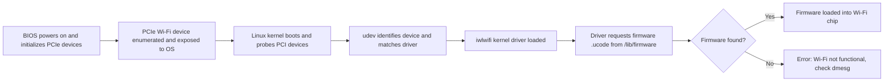

# My struggles installing Ubuntu

Let's learn concepts of linux and computer by following my journey of installing Ubuntu.

  <a href="https://github.com/bilguundottech/ubuntu-install-problems" target="_blank" class="slidev-icon-btn">
    <carbon:logo-github />
  </a>

<!--
Today I will be talking about my experiences installing Ubuntu on my PC and struggles I faced doing so. 
This is not a how to guide, but rather I will try to teach you about certain concepts about Linux and computer through my journey.
On right bottom side you can see an image of a person. I will not reveal who it is yet, so please keep watching until the end.
This person will be connected to why I chose to install Ubuntu in the first place.
I would like to connect that to a discussing about Linux and other OS at the end of my presentation.
-->

---
transition: slide-left
layout: image-right
image: /my_machine.jpg
---

# Meet my machine

Custom built PC optimized for gaming and machine learning tasks. (disclaimer: I didn't build it myself)

- **CPU**: Intel i5-14400F (16) @ 4.700GHz
- **GPU**: NVIDIA GeForce RTX 4060
- **RAM**: 32GB DDR5
- **Storage**: 1TB SSD
- **Host**: GIGABYTE B760M GAMING WIFI PLUS

<!--
So before I begin, let me introduce you to my machine.
This is my custom built PC, which I use for gaming and machine learning tasks.
It has Intel i5-14400F CPU (Recent generation of Intel i5 series, F stands for no integrated graphics so I needed a separate GPU)
NVIDIA GeForce RTX 4060 GPU (Recent generation of NVIDIA RTX 4060, which is a mid-range GPU, most affordable from NVIDIA's 40 series)
32GB DDR5 RAM (
and 1TB SSD storage.
-->

---
layout: center
transition: slide-up
---

# Ubuntu installation flow

1. Download an Ubuntu Image and create a bootable USB stick.

---
layout: center
transition: slide-up
---

<!--
Booting is the process where a computer starts up and loads the OS from the storage device into RAM.
In this case, the storage device is a USB stick, which contains the Ubuntu image.
-->

# Ubuntu installation flow

2. Boot from the USB stick and install Ubuntu

<!--
When computer starts up, it runs a program called BIOS, which looks for a bootable device and hands control over to the OS loader.
(GRUB for Linux, Windows Boot Manager for Windows, etc.)  
BIOS(Basic Output/Input System) is firmware interfaces that provide a way for the OS to communicate(not directly) with the hardware and start the boot process.
It sets up hardware into a usable state
Firmware is a software that is embedded in the hardware. 
-->

---
transition: slide-up
layout: center
---

# Ubuntu installation flow

3. Partitioning

<!--
Partitioning is the process of dividing a physical storage device (e.g., SSD or HDD) into separate logical sections (partitions) that the system treats as independent units.
/ - root partition, where the OS is installed. ext4 is a file system type used by Linux.
/home - home partition, where user files are stored. ext4 is a file system type used by Linux.
swap - swap partition, used as virtual memory when RAM is full. It is not a file system, but rather a reserved space on the disk.
efi - EFI partition, used for booting the OS. It is a special partition that contains the bootloader and other files needed for booting.
-->

---
transition: slide-left
layout: center
---

# Ubuntu installation flow

4. Restart and remove the USB stick

<!--
After the installation is done, you need to restart the computer and remove the USB stick.
Because the computer will try to boot from the USB stick again. 
-->

---
transition: slide-left
layout: center
---

# The Problem

Where is Wifi?

<!--
So here is the problem I faced.
After the installation was done, I restarted the computer and removed the USB stick.
But I couldn't find the wifi icon in the top right corner.
So I started investigating.
-->

---
transition: slide-left
layout: center
---

# How does the Wifi "device" work under the hood?

<!--
The BIOS starts by initializing all connected hardware, including PCIe devices like the onboard Wi-Fi module (A). Once initialized, the Wi-Fi device is exposed to the operating system as a standard PCI or USB device (B).

When the Linux kernel boots, it probes available PCI devices (C). This is followed by udev, the device manager, which identifies the hardware using vendor and device IDs and matches it to the appropriate kernel driver—in this case, iwlwifi for Intel wireless chipsets (D).

The iwlwifi driver is then loaded into the kernel (E). Upon loading, it issues a request to the filesystem for a firmware blob—usually a .ucode file—located in /lib/firmware (F).

At this point, the system checks whether the required firmware is available (G). If the firmware is found, the process continues; if not, initialization fails and logs an error.
-->

---
transition: slide-left
layout: image-right
image: /ubuntu_images.png
---

# What worked?

Kernel version was too new and the driver was not stable enough.

<!--
-->

---
transition: slide-left
layout: image-right
image: /omakub.webp
---

# Meet Omakub

An Omakase Developer Setup for Ubuntu 24.04+ by DHH

<!--
-->

